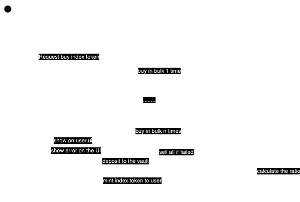
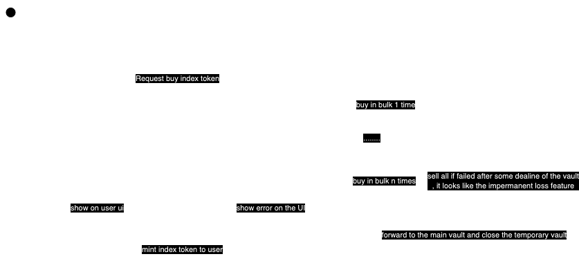

## Solutions design

### Requirements
1. Buy bulk of 20-30 meme coins using the user's assets
2. Lock up those meme coins
3. Mint and provide index tokens to the user
- When the user sells index tokens, the system must sell the corresponding meme coins and pay out the proceeds

### Research
Based on the report at [fully-report.md](./fully-report.md) we can extract 2 problems as below

- 1: The total meme tokens we can buy at 1 times can't be 20-30 as need.
- 2: The compute and accounts in params limitation can limit us to keep the maximun token can buy at 1 times is not stable as much as need

### Solution I:
- User buy a bulk of token in to their wallet and deposit to our vault and mint the index token

- In this solution, we need to storage the token amount we just buyed to rollback (sell) when the middle of the tx was failed

### Solution II:
- User buy a bulk of token and send to a temporary vault in 1 tx (*)

- If user sucess to buy the desired amount in a deadline of the time or ratio, we will process to support user can mint the index fund and close the temporary vault, send token to the main vault

Problems:
- What problem if we rebalance during the user's process

Next actions:
- Admin buy the index token -> optimize for a prelookup table

-----
30 lp pool, each pool have one type meme
-----
user request to buy index fund -> transfer the meme -> vault with buyed ratio
-> we get SOL to our vault -> mint index token
------
- Share the fees for the depositer
